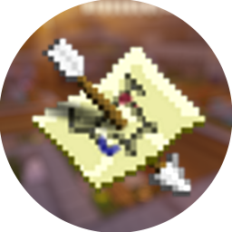

<h1 align="center">RoyalCreep's Launcher</h1>
<a href="https://github.com/luuxis/Selvania-Launcher">FORK de Luuxis</a>

[
]()

[
]()

    

---

### **<ins>
Téléchargement :
**

Vous pouvez télécharger le launcher à partir des [Releases GitHub](../../../releases).

Plateformes supportées :

- Windows 
- Linux
- MacOS

Si vous téléchargez à partir des Releases, sélectionnez le programme d'installation de votre système.

 Plateforme | Fichier |
| -------- | ---- |
| Windows x64 | `RoyalCreeps-win-x64.exe ` |
| macOS universal | `RoyalCreeps-Launcher-mac-universal.pkg` |
| Linux x64 | `RoyalCreeps-Launcher-linux-x86_64.AppImage` |

---
